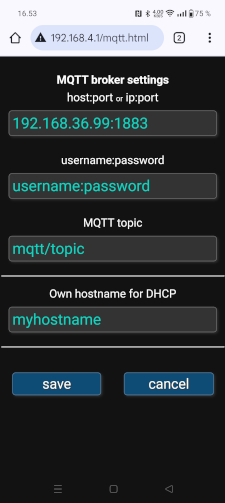

# gpsmqtt
An ESP8266 based GPS tracker with MQTT

A Web-configurable device with GPS receiver which sends location data to a MQTT broker. In my own configuration I have Mosquitto as a broker and InfluxDB + Telegraf with MQTT plugin. See an [example configurations](https://github.com/oh2mp/esp32_ble2mqtt/blob/main/CONFIG_EXAMPLES.md) from my another repository.

The data is sent as JSON of this format:

`{"la":%.6f,"lo":%.6f,"kmh":%.0f,"cou":%.0f,"alt":%.0f}`

Where la = latitude, lo = longitude, kmh = kilometers per hour, cou = course as degrees and alt = altitude in meters

## Hardware

The GPS module is Beitian BN-280 which is a cheap and working module which supports GPS and Glonass. 
They are available eg. in AliExpress. Any other standard module would work too.

The TX of the GPS module is connected to GPIO13 with a voltage divider because the GPS module is 5V and ESP8266 is 3.3V.

Here is my prototype.

## Smart beaconing
The device uses SmartBeaconing™ algorithm by Tony Arnerich KD7TA and Steve Bragg KA9MVA to choose when the packets are sent. 

See https://www.w8wjb.com/qth/QTHHelp/English.lproj/adv-smartbeaconing.html 

Thanks to [OH2TH](https://github.com/oh2th) for the SmartBeaconing code.

## Extra Libraries needed
Here are the versions I had installed when I compiled this in Arduino IDE 2.3.4

- EspSoftwareSerial 8.1.0
- PubSubClient 2.8

I have included here a local copy of Mikal Hart's [TinyGPSPlus](https://github.com/mikalhart/TinyGPSPlus)

## Filesystem
You can use the ESP8266 filesystem uploader tool to upload the contents of data directory. It contains the html pages for the configuring portal and base config files. Or you can just upload the provided image with upload.py. The command is something like this. Change the path and port (if needed)

`/path/to/esp8266/tools/upload.py --chip esp8266 --port /dev/ttyUSB0 --baud 115200 write_flash 0x100000 data.spiffs`

## Portal mode

If GPIO2 is grounded, the device starts portal mode.

Take eg. your phone and connect to WiFi `ESP8266 GPS2MQTT`, accept that there's no internet connection and take your browser to `http://192.168.4.1/`

The web GUI should be quite self explanatory.

 

 

## APRS

If you have a radio amateur license and want to use this with APRS, I have made a mqtt2aprs Perl script, 
which can be used as a systemd service. Just ask for it. For lowering the risk of unlicensed people to 
connect APRS-IS network, I will not put it in public distribution.

